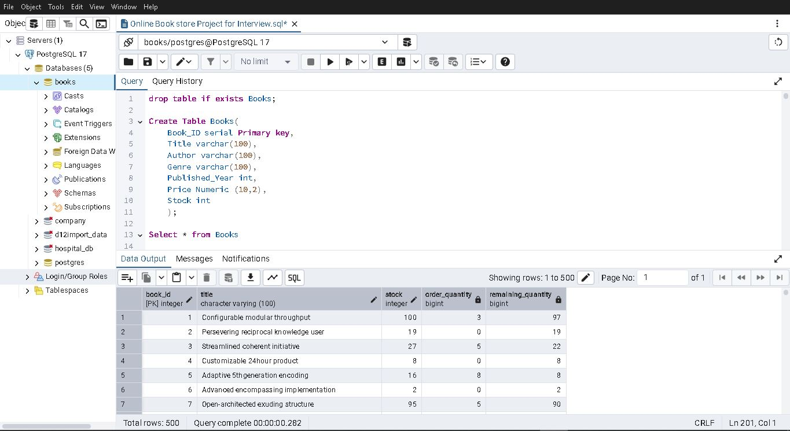

# SQL Online Book Store Project

This project simulates a mini online bookstore system using SQL and mock data.

## 📂 Files Included:
- `Online Book Store Project for Interview.sql` – Main SQL query file
- `Books.xlsx`, `Customers.xlsx`, `Orders.xlsx` – Data source files
- `books_table_query_demo.jpg` – Screenshot of the SQL table & data
- `SQL Project Questions Day 30.pdf` – Practice questions

## 🛠️ Skills Used:
- SQL Joins, Aggregation, Filtering
- Subqueries, Grouping
- Basic Data Cleaning

## 📸 SQL Table Demo

Below is a screenshot of the `Books` table created using PostgreSQL in pgAdmin, showing a SELECT query result with mock data:

